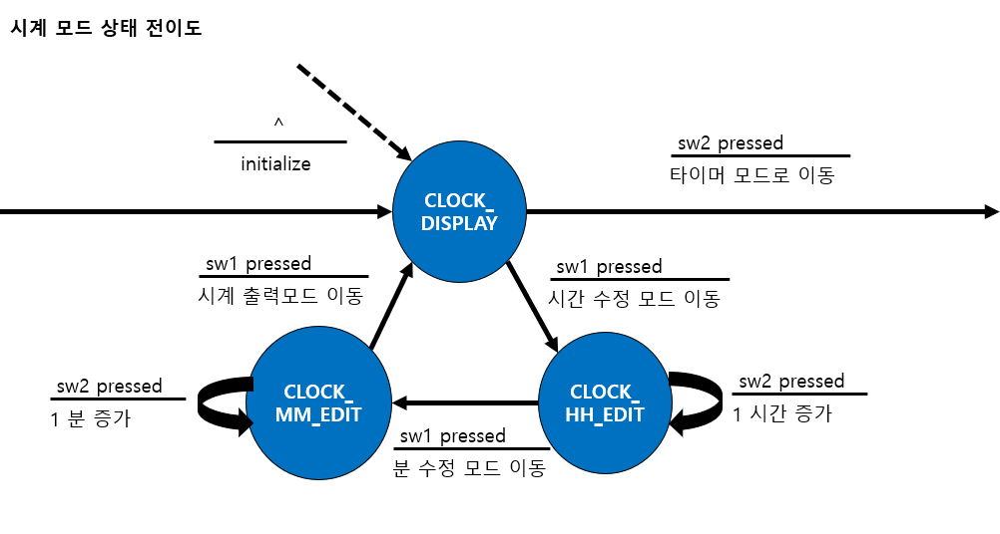

# 임베디드 소프트웨어 최종 과제

<div style="overflow:hidden">
</div>

**JKIT-128-1(atmega128(AVR) 개발/실습 키트)** 를 활용하여 4가지 모드를 지원하는 디지털 시계 제작.

## 주제 : 4가지 모드 지원 시계

- 24시간 디스플레이 시계 모드
- 분, 초 단위 카운트 타이머 모드
- 온도 디스플레이 모드
- 조명도 디스플레이 모드

### 24시간 디스플레이 시계 모드

현재 시간을 설정하여 시간을 FND 화면에 출력하는 모드다. 총 86,400 초(24시간)를 카운트 할 수 있는 전역변수(**ClockSCount**)를 설정한다. 그 다음 16bit **TIMER1**를 이용해서 1초 단위로 타이머 인터럽트를 발생시키고 ClockSCount 값을 변경시킨다. ClockSCount 값을 이용해서 시간, 분을 계산하고 FND에 출력한다.

이 모드에서 SW1 버튼을 누르면 시간 단위를 수정할 수 있는 모드가 된다. 이 상태에서 SW2 버튼을 누르면 1 시간 단위가 증가한다. 다시 SW1 버튼을 누르면 분 단위를 수정할 수 있는 모드가 되고, 이 상태에서 SW2를 누르면 1분단위가 증가한다. 다시 SW1를 누르면 정상적인 시간 출력 화면으로 이동한다.

시계 출력 모드에서 SW2를 누르면 분, 초 단위 카운트 타이머 모드로 전환된다.

아래 그림은 시계 모드에서 스위치가 눌림에 따라 변화하는 동작을 설명하는 상태 전이도이다.



### 분, 초 단위 카운트 타이머 모드

<center></center>

사용자가 설정한 단위의 시간이 지나면 버저가 울리는 기능이다.

맨 처음에는 00:00이 FND에 표시된다. 맨 처음 SW1을 누르면 분 단위를 수정할 수 있는 모드가 된다. 그 다음 SW2를 누르면 1분 단위가 증가한다. 다시 SW1을 누르면 초 단위를 수정할 수 있는 모드가 된다. 그 다음 SW2를 누르면 1초 단위가 증가한다. 마지막으로 SW1을 누르면 곧바로 카운트를 시작한다. 시간을 카운트 하는 도중에 SW1을 누르면 멈추게 되고, 다시 SW1을 누르면 카운트가 재시작한다. 또는 SW2를 누르게 되면 카운트가 리셋되어 00:00이 FND에 출력된다.

사용자가 설정한 분, 초 단위의 시간을 초 단위 값으로 변환 후 전역변수 **TimerSCount** 에 저장한다. 매 초마다 FND에 남은 시간을 출력하고 TimerSCount 값을 1씩 줄인다. TimerSCount 값이 0이 되었을 때 버저가 울리도록 한다.

아래 그림은 카운트 타이머 모드에서 스위치가 눌림에 따라 변화하는 동작을 설명하는 상태 전이도이다.


### 온도 디스플레이 모드

jkit-128-1에 달린 **온도센서**를 이용해서 온도를 측정하고 FND에 출력하는 모드다.


### 조명도 디스플레이 모드

<div style="overflow:hidden;"></div>

<br>

jkit-128-1에 달린 **CdS 광센서** 를 이용해서 조도에 따라 LED를 켜거나 끄는 모드다.


## 전체 소스코드

[lab2.c](./app/lab2.c)

## 전체 Task 실행 개괄


총 7개의 Task가 있다. 이들 Task의 이름과 우선순위 및 기능을 위 그림에서 간단하게 나타내었다.

### Mode 전역 변수와 관련 상수

현재 시스템이 어떤 모드에 있는지 체크하기 위해서 Mode라는 전역변수를 만들었고, 이 변수는 다음과 같은 상수들을 저장한다.

```c
/* 전체 상태 관리 상수 */
#define CLOCK_DISPLAY     0
#define CLOCK_HH_EDIT     1
#define CLOCK_MM_EDIT     2

#define TIMER_STOP        3
#define TIMER_MM_EDIT     4
#define TIMER_SS_EDIT     5
#define TIMER_COUNT       6
#define TIMER_PAUSE       7
#define TIMER_ALARM       8

#define TEMP_DISPLAY      9
#define LIGHT_DISPLAY    11
```

### 스위치 인터럽트와 Sw1, Sw2 전역변수

시계의 모드를 변경하려면 스위치를 눌러야 한다. 이 스위치 눌림 동작을 처리하기 위해서 2개의 스위치에 대한 인터럽트 처리를 하였다. 이들 인터럽트 서비스 루틴에서는 스위치가 눌림에 따러 처리해야하는 일들을 수행하고, 전역적으로 선언된 BOOLEAN형 **Sw1**에 **Sw2** 변수에 true 값을 설정한다. 후에 ControlTask에서 호출되는 **change_mode()** 와 **switch_task()** 라는 함수에서 이 값에 따라 Mode 변수 값을 적절히 바꾸고, TaskControlFlag 값을 적절하게 수정하게된다.

```c
// Sw1
ISR(INT4_vect) {
    _delay_ms(50);  // debouncing
    if (PINE == 0x10) return;

    Sw1 = TRUE;
    OSSemPost(SwitchToControlSem);
}

// Sw2
ISR(INT5_vect) {
    INT8U i;
    _delay_ms(50);  // debouncing
    if (PINE == 0x20) return;

    Sw2 = TRUE;
    ...
    OSSemPost(SwitchToControlSem);
}
```

### ControlTask

가장 높은 0번 우선순위를 갖는 테스크이다. **ControlTask** 는 **TaskControlFlag** 라는 이벤트 플래그에 적절한 비트를 설정한다. 나머지 테스크들은 TaskControlFlag 값을 Pend 하여 적절한 Flag가 설정되면 실행 가능 상태가 된다.

```c
void ControlTask (void *data)
{
    INT8U err;

    for(;;) {

        // 스위치 눌림 체크
        // 여기서 blocking 되어 다른 Task에게 실행 양도
        OSSemPend(SwitchToControlSem, 0, &err);

        // 눌린 스위치에 따른 Mode 값 변경
        OSSemPend(Sem, 0, &err);
        change_mode();
        OSSemPost(Sem);

        // TaskControlFlag를 적절히 설정하여 현재 Mode 값에 알맞는 Task들 실행
        OSSemPend(Sem, 0, &err);
        switch_task();
        OSSemPost(Sem);
    }
}
```

이 테스크의 우선순위가 가장 높지만, 위 코드에서 볼 수 있듯이 반복문의 처음에서 **SwitchToControlFlag** 라는 세마포를 Pend하게 하여 이 세마포를 획득한 경우에만 잠깐 실행되고 하고 다른 테스크들에게 실행을 양도 하도록 하였다. 이 세마포는 **SW1, SW2 인터럽트 핸들러**에서 **Post** 한다. **즉, ControlTask는 버튼이 눌릴때만 잠깐 실행되어 TaskControlFlag 값을 설정하고 Task들의 실행 순서를 결정한다.**

## 24시간 디스플레이 시계 모드 구현

### TIMER1 관련 설정

1초 단위마다 계속해서 인터럽트하여 시간을 계산하기 위해서 **TIMER1**을 사용했다. 이를 위해 관련 레지스터를 다음과 같이 설정하였다.

```c
// 시간을 계산하기 위해 타이머 1 분주비 설정
OS_ENTER_CRITICAL();
TCCR1B = ((1 << CS12) | (0 << CS11) | (1 << CS10)); // timer1 1024 prescaling
TIMSK |= (1 << TOIE1);  // timer1 overflow interrupt enabled
TCNT1 = ONE_SEC;
OS_EXIT_CRITICAL();
```

클록을 1024 분주하여 계산하도록 설정했다. ATmega128의 Clock rate는 16MHz이며 따라서 분주된 클록의 주기는 64&micro;s 가 되고, 1초를 측정하기 위해서 총 15,625‬개의 클록이 필요하다. 이를 카운트 하기위해 TCNT1 레지스터에는 -15,626을 나타내는 상수 **ONE_SEC**를 대입하였다(-15,626를 TCNT1에 저장하면 2^16 - 15,625 값을 저장한 것과 동일한 효과를 낸다).

그 다음 인터럽트 서비스 루틴을 다음과 같이 등록하여 1초마다 ClockSCount 값이 1 씩 증가하도록 하였다.

```c
// Timer1 1초마다 실행
ISR(TIMER1_OVF_vect) {
    TCNT1 = ONE_SEC;
    ClockSCount = (ClockSCount + 1) % 86400;
}
```

### 화면에 시간 출력

24시간 디스플레이 모드를 관리하는 테스크는 **ClockTask**이다.

```c
// 현재 시간을 출력하는 테스크
void ClockTask (void *data)
{
    INT8U err;
    INT8U i;
    INT32U temp_hour;

    for (;;) {
        OSFlagPend(TaskControlFlag, 0x01, OS_FLAG_WAIT_SET_ALL, 0, &err); // no consume
        calculate_hh_mm(ClockSCount);

        PORTA = 0x80;

        // 현재 시간 출력
        // 깜빡거리는 효과를 위해서 0.5초는 정상출력, 0.5초는 FND의 특정 세그먼트를 제외하고 출력
        ClockFnd[2] += dot;
        for (i = 0; i < 50; i++) {
            display_fnd(ClockFnd);
            if (Mode != CLOCK_DISPLAY && Mode != CLOCK_HH_EDIT && Mode != CLOCK_MM_EDIT)
                break;
        }

        ClockFnd[2] -= dot;
        if (Mode == CLOCK_HH_EDIT) {
            ClockFnd[3] = 0;
            ClockFnd[2] = 0;
        }
        else if (Mode == CLOCK_MM_EDIT) {
            ClockFnd[1] = 0;
            ClockFnd[0] = 0;
        }
        
        for (i = 0; i < 50; i++) {
            display_fnd(ClockFnd);
            if (Mode != CLOCK_DISPLAY && Mode != CLOCK_HH_EDIT && Mode != CLOCK_MM_EDIT)
                break;
        }
    }
}
```

ClockTask 내부 반복에서는 먼저 다음과 같이 TaskControlFlag에 ClockTask가 실행될 수 있는 상태로 비트가 설정되어 있는지 판단한다.

```c
OSFlagPend(TaskControlFlag, 0x01, OS_FLAG_WAIT_SET_ALL, 0, &err);
```

위 함수는 이벤트 플래그에 설정된 비트를 consume 하지 않는데 그 이유는 스위치가 눌리지 않는 이상 플래그 값을 그대로 두어 ControlTask 가 이벤트 플래그를 계속해서 설정하지 않아도 ClockTask가 반복적으로 실행 되도록 하기 위함이다.

그 다음 **calculate_hh_mm()** 라는 함수를 통해서 **ClockSCount** 값에서 시간과 분을 추출한뒤, 이 값을 **ClockFnd** 라는 전역 배열에 저장하고, **display_fnd()** 함수 호출을 통해서 FND에 시간을 출력하게 된다.

### 시간 수정

현재 Mode 값이 시간과 분을 수정할 수 있는 상태라면 Sw2를 눌렀을때 시간과 분이 1씩 증가하도록 한다. Sw2의 인터럽트 핸들러에서 clock_edit() 함수를 호출하면서 이를 구현한다.

```c
// Sw2
ISR(INT5_vect) {
    ...
    Sw2 = TRUE;
    if (Mode == CLOCK_HH_EDIT || Mode == CLOCK_MM_EDIT) {
        clock_edit();
        Sw2 = FALSE;
    }
    ...
}
```

clock_edit() 함수에서는 Sw2가 눌려 자신이 호출될때마다, ClockSCount값을 다음과 같이 수정하게 된다. 이와 같은 시간 수정 방식은 타이머 모드에서도 유사한 형태로 구현되었다.

```c
// 시간을 1 시간 또는 1 분 증가시키는 함수
void clock_edit(void) {
    if (Mode == CLOCK_HH_EDIT) {
        ClockSCount = (ClockSCount + 3600) % 86400;
    }
    else if (Mode == CLOCK_MM_EDIT) {
        INT32U temp_hour = ClockSCount / 3600; 
        ClockSCount = (ClockSCount + 60) % 86400;

        // 분 단위 변경으로 인해 시간 단위가 변경되는 것 방지
        if (temp_hour != ClockSCount / 3600) {
            ClockSCount = temp_hour * 3600;
        }
    }
    calculate_hh_mm(ClockSCount);
}
```

## 분, 초 단위 카운트 타이머 구현

분, 초 단위 카운트 타이머 모드는 **TimerAlarmTask**와 **TimerTask**가 협력하여 수행한다.

```c
// 사용자가 설정한 타이머를 카운트하고 FND에 출력하는 테스크
void TimerTask (void * data)
{
    INT8U err;
    INT8U i;
    volatile BOOLEAN TimesUp = FALSE;

    for(;;) {
        OSFlagPend(TaskControlFlag, 0x02, OS_FLAG_WAIT_SET_ALL, 0, &err); // no consume
        calculate_mm_ss(TimerSCount);

        PORTA = 0x40;

        if (Mode == TIMER_STOP || Mode == TIMER_PAUSE || Mode == TIMER_ALARM) {
            if (TimesUp == TRUE) {
                TimesUp = FALSE;
                OSSemPost(TimerSem);
            }

            TimerFnd[2] += dot;
            for (i = 0; i < 100; i++) {
                display_fnd(TimerFnd);
                if (Mode != TIMER_STOP && Mode != TIMER_PAUSE && Mode != TIMER_ALARM)
                    break;
            }
        }
        else if (Mode == TIMER_COUNT) {

            TimerFnd[2] += dot;
            for (i = 0; i < 50 && Mode == TIMER_COUNT; i++) {
                display_fnd(TimerFnd);
            }

            TimerFnd[2] -= dot;
            for (i = 0; i < 50 && Mode == TIMER_COUNT; i++) {
                display_fnd(TimerFnd);
            }

            if (TimerSCount == 0) {
                Mode = TIMER_ALARM;
                TimesUp = TRUE;
            }
            else {
                if (Mode == TIMER_PAUSE)
                    continue;
                TimerSCount -= 1;
            }
        }
        else { // if Mode == TIMER_MM_EDIT || Mode == TIMER_SS_EDIT
            TimerFnd[2] += dot;
            for (i = 0; i < 50 && (Mode == TIMER_MM_EDIT || Mode == TIMER_SS_EDIT); i++) {
                display_fnd(TimerFnd);
            }

            TimerFnd[2] -= dot;
            if (Mode == TIMER_MM_EDIT) {
                TimerFnd[3] = 0;
                TimerFnd[2] = 0;
            }
            else if (Mode == TIMER_SS_EDIT) {
                TimerFnd[1] = 0;
                TimerFnd[0] = 0;
            }
            for (i = 0; i < 50 && (Mode == TIMER_MM_EDIT || Mode == TIMER_SS_EDIT); i++) {
                display_fnd(TimerFnd);
            }
        }
    }
}
```

TimerTask 내부 반복에서는 먼저 다음과 같이 TaskControlFlag에 TimerTask가 실행될 수 있는 상태로 비트가 설정되어 있는지 판단한다.

```c
OSFlagPend(TaskControlFlag, 0x02, OS_FLAG_WAIT_SET_ALL, 0, &err);
```

**TimerTask** 내부에서는 주로 **calculate_mm_ss()** 함수 호출을 통해 현재 TimerSCount 값에서 분과 초를 추출하여 FND에 출력하는 일을 한다. 또한 카운트가 진행중일때 TimerSCount 값을 1초마다 하나씩 줄이며, 이 값이 0이 되었을때 Mode 값을 **TIMER_ALARM**으로 바꾼다. 타이머가 정지 상태일때는 같은 값을 반복해서 출력하도록 한다.

**TimerAlarmTask**는 우선순위 상 TimerAlarmTask가 TimerTask 보다 높지만 다음 그림과 같이 **TimerSem** 이라는 세마포를 획득하는 경우에만 실행되기 때문에 평소에는 실행을 TiemrTask에게 양도하게 된다.


TimerSCount 값이 0이 되었을 때 TimerTask는 다음과 같이 TimerSem 세마포 카운트를 1 증가 시키고 TimerAlarmTask가 실행되도록 한다.

```c
if (TimesUp == TRUE) {
    TimesUp = FALSE;
    OSSemPost(TimerSem);
}
```

### 알람 울리기

알람을 울리는 일은 TimerAlarmTask가 수행하는데 다음과 같이 정의되어 있다.

```c
void TimerAlarmTask(void *data)
{
    INT8U err;

    for(;;) {
        OSSemPend(TimerSem, 0, &err);
        note_idx = 0;
        mel_idx = 0;

        TIMSK |= (1 << TOIE2);    // 알람 출력을 위해 timer2 overflow interrupt enabled
        TCNT2 = melody[mel_idx];

        while(Mode == TIMER_ALARM) {
            OSTimeDly(note[note_idx]);    // FND 출력과 음계 출력을 위한 양도
            note_idx = (note_idx + 1) % MELODY_LEN;
            mel_idx = (mel_idx + 1) % MELODY_LEN;
        }
        TIMSK &= ~(1 << TOIE2);    // 알람 종료를 위해 timer2 overflow interrupt disabled
    }
}
```

반복문의 맨 처음에서 TimerSem을 Pend하여 blocking 됨을 알 수 있다.

버저에 음계를 출력하기 위해서 **Timer2**를 이용하였다. **TCNT2** 값에는 특정 음에 대한 주기의 절반을 대입하여, 정해진 시간마다 타이머 인터럽트가 발생하도록 하였다. 그 다음 반복문을 돌면서 **note_idx**, **mei_idx** 라는 값을 1 씩 증가시키고 있다. 이 값들은 각각 **note**와 **melody** 라는 미리 정의한 배열의 원소들을 가리키는 인덱스로 사용된다. melody에는 알람이 울릴때 나오는 노래의 음계들을, note에는 각 음계에 대한 박자들을 저장하고 있다. 반복문이 한번씩 진행 될때마다 **OSTimeDly(note[note_idx])** 가 호출되어 다시 TimerTask에게 실행을 양도 하도록 하는데, 이는 특정 시간만큼 음계가 출력되도록 하고, 동시에 FND 역시 꺼지지 않고 계속 출력되도록 하기 위함이다.

Timer2의 오버플로우 인터럽트 핸들러는 다음과 같이 정의하였다. 오버플로우 인터럽트가 발생할 때마다 버저를 on, off 하여 음계를 출력하고, TCNT2값을 다시 세팅한다.

```c
// Timer2 음계 출력
ISR (TIMER2_OVF_vect) {
    if (Mode == TIMER_ALARM) {
        if (melody[mel_idx] == MUT) {
            PORTB = 0x00;
        }
        else {
            if (state == ON) {
                PORTB = 0x00;
                state = OFF;
            }
            else {
                PORTB = 0x10;
                state = ON;
            }
        }
        TCNT2 = melody[mel_idx];
    }
    else {
        state = OFF;
        PORTB = 0x00;
    }
}
```

## 온도 출력 모드 구현

온도 출력 모드는 **TemperatureTask** 와 **TemperatureDisplayTask** 가 협력하여 수행한다.

```c
// 현재 온도를 계산하는 테스크. 현재 온도값을 계산하여 TempMbox 메일박스에
// 전달하고, TemperatureDisplayTask가 이를 화면에 출력할 수 있도록
// OSTimeDly 를 통해 실행을 양도한다.
void TemperatureTask (void *data)
{
    int	value;
    INT8U err;

    data = data;

    write_twi_1byte_nopreset(ATS75_CONFIG_REG, 0x00);
    write_twi_0byte_nopreset(ATS75_TEMP_REG);
    while (1)  {
        OSFlagPend(TaskControlFlag, 0x04, OS_FLAG_WAIT_SET_ALL, 0 ,&err);  // no consume;
        PORTA = 0x20;

        OS_ENTER_CRITICAL();
        value = ReadTemperature();
        OS_EXIT_CRITICAL();

        OS_ENTER_CRITICAL();
        OSMboxPost(TempMbox, (void*)& value);
        OS_EXIT_CRITICAL();

        OSTimeDly(100);
    }
}

// 현재 온도를 FND에 출력하는 테스크.
void TemperatureDisplayTask (void *data)
{
    INT8U value;
    INT8U err;

    void *temp;
    data = data;

    for(;;) {
        OSFlagPend(TaskControlFlag, 0x04, OS_FLAG_WAIT_SET_ALL, 0 ,&err);  // no consume;
        temp = OSMboxAccept(TempMbox);
        if (temp != (void*)0) {
            value = *(INT8U*)temp;
        }

        PORTC = digit[value % 10];
        PORTG = 0x01;
        _delay_ms(2);
        PORTC = digit[value / 10];
        PORTG = 0x02;
        _delay_ms(2);
    }
}
```


TemperatureTask와 TemperatureDisplayTask 내부 반복에서는 먼저 다음과 같이 TaskControlFlag에 TemperatureTask 실행될 수 있는 상태로 비트가 설정되어 있는지 판단한다.

```c
OSFlagPend(TaskControlFlag, 0x04, OS_FLAG_WAIT_SET_ALL, 0 ,&err);  // no consume;
```

TemperatureTask는 온도센서와 **TWI 통신**을 하여 현재의 온도값을 읽어온 뒤, **TempMbox** 라는 메일박스에 온도값을 전달하고, OSTimeDly를 통해 TemperatureDisplayTask 에게 실행을 양도한다.

TemperatureDisplayTask는 반복문 내부에서 **OSMboxAccept()** 함수를 통해 온도값을 전달받는다. **OSMboxPend** 가 아닌 **OSMboxAccept** 를 호출하는 이유는 TemperatureTask가 계속해서 메일박스에 메시지를 전달하지 않아도 되도록 하기 위함이다.

```c
temp = OSMboxAccept(TempMbox);
if (temp != (void*)0) {
    value = *(INT8U*)temp;
}
```

TemperatureDisplayTask는 메일 박스를 통해 전달받은 온도값을 FND에 출력한다.

## 조명도 출력 모드 구현

조명도 출력 모드는 **LightTask** 가 수행한다. LightTask 내부 반복문에서는 먼저 TaskControlFlag에 LightTask가 실행될 수 있는 상태로 비트 설정이 되어 있는지 판단한다(3번째 비트가 설정되어 있어야 한다). 그 다음 **read_adc()** 라는 함수를 호출하여 현재 조명에 따른 CdS 센서값을 읽어서 반환한다. 이 값을 **show_adc()** 라는 함수에 넘겨주어 조명값에 따라서 LED를 켠다.

```c
// 현재 조명값에 따라서 LED를 켜거나 끄는 테스크
void LightTask(void *data)
{
    INT8U err;
    unsigned short value;

    while(1)
    {
        OSFlagPend(TaskControlFlag, 0x08, OS_FLAG_WAIT_SET_ALL, 0 ,&err);  // no consume;
        value = read_adc();
        show_adc(value);
    }
}
...
// 현재 조명에 대한 값을 반환하는 함수
unsigned short read_adc()
{
    unsigned char adc_low, adc_high;
    unsigned short value;

    ADCSRA |= 0x40;     // start conversion
    while((ADCSRA & 0x10) != 0x10);

    adc_low = ADCL;
    adc_high = ADCH;
    value = (adc_high << 8) | adc_low;

    return value;
}

// 주어진 조명값에 따라서 LED를 켜는 함수
void show_adc(unsigned short value)
{
    if(value < CDS_1LUX)
        PORTA = 0xff;
    else if (value < CDS_10LUX)
        PORTA = 0xaa;
    else if ( value < CDS_100LUX)
        PORTA = 0x42;
    else
        PORTA = 0x00;
}
```